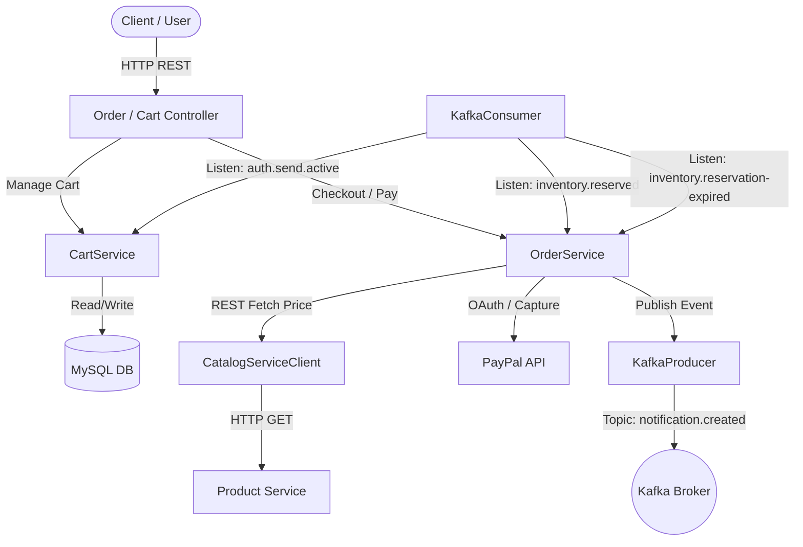
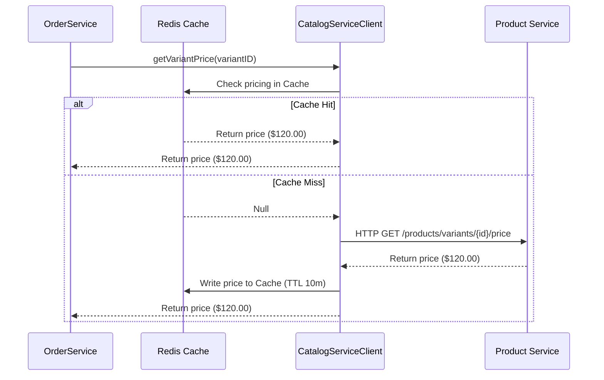
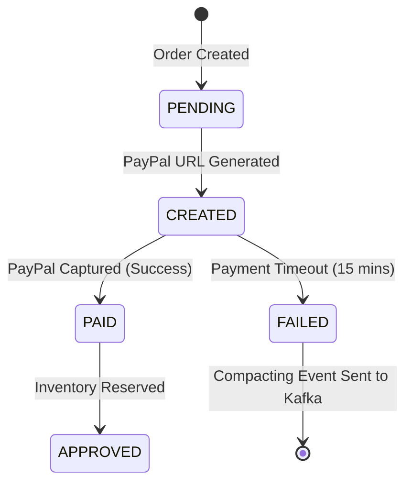
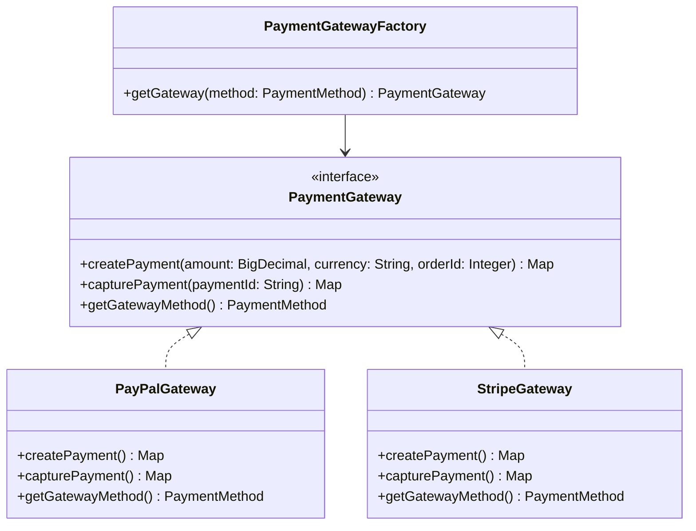

# 📊 Furniro Order Service - System Analysis & Enhancement Plan

This document contains a comprehensive technical analysis of the **Furniro Order Service** and outlines a series of production-grade architectural and feature enhancements to take the backend ecosystem to a premium, resilient level.

---

## 🔍 1. Current System Architecture Analysis

The `OrderService` is a robust Spring Boot microservice handling core cart and order processing operations. Based on the code review, here is the current architectural flow:



### ⚙️ Technical Core Metrics & Setup
*   **Framework**: Spring Boot 4.0.5 with Java 17.
*   **Persistence**: Spring Data JPA with a MySQL database.
*   **Integrations**: Apache Kafka for event communication; PayPal Sandbox SDK for processing transactions.
*   **Infrastructure dependencies**: MySQL, Redis, and Apache Kafka.

### 💡 Strengths of Current Implementation
1.  **Backend Price Verification**: During order creation (`createOrder`), the service retrieves current prices from the external `CatalogServiceClient` instead of relying on frontend-provided prices. This prevents malicious price tampering.
2.  **Idempotent Payment Capture**: PayPal captures verify the state of the PayPal payment before initiating capture requests, avoiding duplicate transaction charges.
3.  **Event-Driven Cart Creation**: The application automatically creates a user's shopping cart upon receiving the `auth.send.active` event from Kafka (user registration).

### ⚠️ Areas for Architectural Improvement (Current Bottlenecks)
*   **High Latency in Price Verification**: In `CatalogServiceClient.java`, a synchronous REST request is made to the Product Service for *every* unique variant in the cart. Under high checkout volume, this microservice-to-microservice REST overhead will degrade checkout latency.
*   **Lack of Automatic Order Expiration**: If a user initiates a PayPal checkout but fails to complete the transaction on the PayPal portal, the order remains in `CREATED`/`PENDING` indefinitely. This leaks reserved inventory unless manually corrected.
*   **Tightly Coupled Payment Gateway**: The `OrderService` holds direct references to `PayPalService`. Adding more payment providers (e.g., Stripe, local digital wallets, Apple Pay) would require heavily refactoring the core business logic.
*   **Missing JWT User ID Validation**: The controllers accept raw `userID` parameters (e.g. `@RequestParam Integer userID` or in request bodies). In a production environment, this is a security vulnerability unless validated against the security context extracted from a JWT token.

---

## 🚀 2. Proposed Feature Additions & Enhancements

Here are four high-value features designed to improve resiliency, security, scalability, and developer experience.

---

### 🎨 Feature 1: High-Performance Redis Pricing Cache
**Goal**: Introduce a fast-access cache layer for product variant pricing to reduce inter-service REST overhead and ensure checkout operations are sub-millisecond.



#### Key Implementation Steps:
1.  **Configure Cache Manager**: Enable Spring Caching (`@EnableCaching`) backed by Redis.
2.  **Cache Pricing Method**: Decorate `getVariantPrice` in `CatalogServiceClient` with `@Cacheable`:
    ```java
    @Cacheable(value = "variantPrices", key = "#variantID", unless = "#result == null")
    public BigDecimal getVariantPrice(Integer variantID) { ... }
    ```
3.  **Establish Cache Eviction**: Ensure that when a product price changes in the catalog, a Kafka event (`catalog.price-updated`) is consumed to invalidate the cache key using `@CacheEvict`.

---

### ⏰ Feature 2: Automated Order Expiration & Stock Reclaim
**Goal**: Release locked resources and reclaim warehouse stock by auto-expiring unpaid orders after a defined duration (e.g., 15 minutes).



#### Key Implementation Steps:
1.  **Create Expiry Scheduler**: Implement a scheduled background service using Spring's `@Scheduled` annotation.
2.  **Identify Unpaid Orders**: Query orders where `status` is `PENDING` or `CREATED` and `orderedAt` is older than 15 minutes.
3.  **Transition & Compensate**:
    *   Transition order status to `FAILED`.
    *   Transition payment status to `CANCELLED`.
    *   Publish an `inventory.release-reservation` event to Kafka so the Inventory Service can unlock the reserved stock.

---

### 🧩 Feature 3: Strategy Pattern for Multi-Gateway Support (Stripe + PayPal)
**Goal**: Decouple payment handling from `OrderService` by introducing a generic payment gateway interface, allowing modular additions of Stripe and Credit Card methods.

#### Proposed Class Structure:


#### Key Implementation Steps:
1.  **Define Interface**: Create a `PaymentGateway` interface defining standard lifecycle operations.
2.  **Implement Adapters**: Implement `PayPalGateway` (migrating logic from `PayPalService`) and `StripeGateway` (integrating Stripe SDK).
3.  **Refactor Checkout**: Resolve gateways dynamically at runtime based on the request's `PaymentMethod` via `PaymentGatewayFactory`.

---

### 🔐 Feature 4: Security Context Auditing & Token-Based Authorization
**Goal**: Enforce strict security compliance by removing insecure `userID` params and verifying requests using JWT principal extraction.

#### Key Implementation Steps:
1.  **Add Security Config**: Define a basic Spring Security configuration to validate JWTs passed in headers.
2.  **Extract Principal dynamically**: Use `@AuthenticationPrincipal` in the controller layers to extract the user's authentic ID:
    ```java
    @GetMapping("/history")
    public ResponseEntity<AType> getOrdersByUserID(
            @AuthenticationPrincipal UserPrincipal principal,
            @RequestParam(required = false) OrderStatus status,
            @RequestParam(defaultValue = "0") java.lang.Integer page) {
        return orderService.getOrderHistoryForUser(principal.getId(), status, page, 10);
    }
    ```
3.  **Secure Admin API Paths**: Annotate Admin APIs with `@PreAuthorize("hasRole('ADMIN')")` to restrict access strictly to system administrators.

---

## 📅 3. Technical Implementation Plan (`plan.md`)

Below is the concrete timeline and steps to execute these recommendations.

### 📍 Component-level Checklist

| Phase | Task Description | Affected Files | Expected Outcome |
| :--- | :--- | :--- | :--- |
| **Phase 1: Performance** | Configure Spring Cache and Redis connection properties | `pom.xml`, `application.yaml`, `CatalogServiceClient.java` | Under-load checkout performance improves by caching variant prices in Redis with a 10m TTL. |
| **Phase 2: Resiliency** | Write background scheduler to capture and close stale orders | `OrderRepository.java`, `OrderService.java`, `OrderExpirationScheduler.java` [NEW] | Automatic cleanup of stale orders. Unpaid stock is reclaimed via Kafka compensating events. |
| **Phase 3: Architecture** | Refactor payments into a generic Strategy-based design patterns | `PaymentGateway.java` [NEW], `PayPalGateway.java` [NEW], `StripeGateway.java` [NEW], `OrderService.java` | The payment processor is fully decoupled. Multi-gateway checkouts are supported. |
| **Phase 4: Security** | Add security filters, parsing JWT tokens for context | `SecurityConfig.java` [NEW], `OrderController.java`, `CartController.java` | Direct `userID` parameters are removed, preventing request tampering. |

---

### 🔬 Verification & Testing Strategy
1.  **Unit & Mock Verification**: Use JUnit and Mockito to verify the dynamic resolution of payment gateways by `PaymentGatewayFactory`.
2.  **Integration Testing**: Verify cache writes, hits, and invalidations using embedded Redis or Testcontainers during automated test phases.
3.  **Event Driven Simulation**: Trigger simulated unpaid timeouts and verify that the `inventory.release-reservation` event is correctly broadcast to Kafka.
4.  **Security Testing**: Attempt endpoint execution without authentication headers or with spoofed `userID` arguments to ensure Spring Security filters block unauthorized requests.
